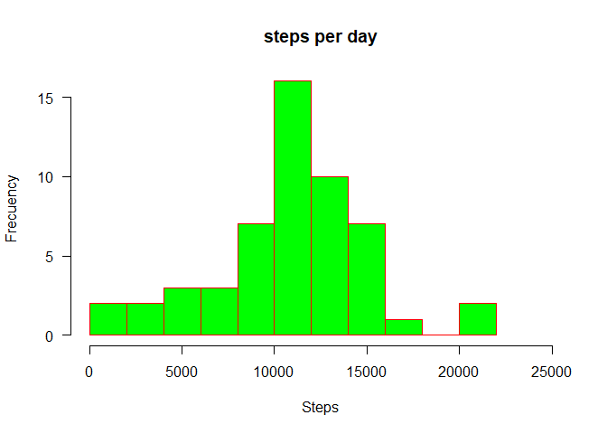

## Loading and preprocessing the data


```r
## Unzip activity.zip and extract its content into datafiles forlder
library(lubridate)
```

```
## 
## Attaching package: 'lubridate'
```

```
## The following objects are masked from 'package:base':
## 
##     date, intersect, setdiff, union
```

```r
unzip(zipfile = "activity.zip", exdir = "./datafiles")
data <- as.data.frame (read.csv("./datafiles/activity.csv", header = TRUE))
data$date <- ymd(data$date)
```

## Histogram of the total number of steps taken each day


```r
library(dplyr)
```

```
## 
## Attaching package: 'dplyr'
```

```
## The following objects are masked from 'package:stats':
## 
##     filter, lag
```

```
## The following objects are masked from 'package:base':
## 
##     intersect, setdiff, setequal, union
```

```r
library(xtable)
stepsxday <- data [!is.na(data$steps),] %>% group_by( by = date) %>%  summarize (sum(steps, na.rm=TRUE))
colnames(stepsxday)  <-  c("Day", "Steps")
xt  <- xtable(head(stepsxday))
print (xt, type="html")
```

```
## <!-- html table generated in R 4.1.1 by xtable 1.8-4 package -->
## <!-- Sun Nov 28 18:50:24 2021 -->
## <table border=1>
## <tr> <th>  </th> <th> Day </th> <th> Steps </th>  </tr>
##   <tr> <td align="right"> 1 </td> <td align="right"> 15615.00 </td> <td align="right"> 126 </td> </tr>
##   <tr> <td align="right"> 2 </td> <td align="right"> 15616.00 </td> <td align="right"> 11352 </td> </tr>
##   <tr> <td align="right"> 3 </td> <td align="right"> 15617.00 </td> <td align="right"> 12116 </td> </tr>
##   <tr> <td align="right"> 4 </td> <td align="right"> 15618.00 </td> <td align="right"> 13294 </td> </tr>
##   <tr> <td align="right"> 5 </td> <td align="right"> 15619.00 </td> <td align="right"> 15420 </td> </tr>
##   <tr> <td align="right"> 6 </td> <td align="right"> 15620.00 </td> <td align="right"> 11015 </td> </tr>
##    </table>
```


```r
hist(stepsxday$Steps,  main="steps per day",  ylab="Frecuency",  xlab="Steps",  border="red", col="green", las=1,breaks=10, xlim = c(0, 25000))
```

<!-- -->


## What is mean total number of steps taken per day?


```r
summary(stepsxday$Steps)  
```

```
##    Min. 1st Qu.  Median    Mean 3rd Qu.    Max. 
##      41    8841   10765   10766   13294   21194
```
The mean is 10766 and de median is 10765 

## What is the average daily activity pattern?


```r
stepsxinterval <- data [!is.na(data$steps),] %>% group_by( by = interval) %>%  summarize (mean(steps, na.rm=TRUE))
colnames(stepsxinterval)  <-  c("Interval", "Steps")
stepsxinterval 
```

```
## # A tibble: 288 x 2
##    Interval  Steps
##       <int>  <dbl>
##  1        0 1.72  
##  2        5 0.340 
##  3       10 0.132 
##  4       15 0.151 
##  5       20 0.0755
##  6       25 2.09  
##  7       30 0.528 
##  8       35 0.868 
##  9       40 0     
## 10       45 1.47  
## # ... with 278 more rows
```

```r
library(ggplot2)
ggplot(data =stepsxinterval, aes(x=Interval, y= Steps)) + geom_line()
```

<!-- -->

## The 5-minute interval that, on average, contains the maximum number of steps

To identify the exact five minute slot with the higher average of steps I only have to order the results from the previous calculation


```r
 head(stepsxinterval[order(-stepsxinterval$Steps),])
```

```
## # A tibble: 6 x 2
##   Interval Steps
##      <int> <dbl>
## 1      835  206.
## 2      840  196.
## 3      850  183.
## 4      845  180.
## 5      830  177.
## 6      820  171.
```
The 5-minute interval that, on average, contains the maximum number of steps is the 835

## Imputing missing values

I will replace each NA five minutes intervals by its average


```r
dataMod <- data
dataMod$interval <-as.factor(dataMod$interval)
dataMod$StepsMeanInt<- tapply(dataMod$steps, dataMod$interval, mean, na.rm = TRUE)
dataMod <- mutate(dataMod, stepsMod = ifelse(is.na(dataMod$steps), dataMod$StepsMeanInt, dataMod$steps))
```

Next I will calculate the sum of steps by date using the new steps column with  imputed missing data


```r
stepsxdayMod <- data [!is.na(data$steps),] %>% group_by( by = date) %>%  summarize (sum(steps, na.rm=TRUE))
colnames(stepsxdayMod)  <-  c("Day", "Steps")
xt  <- xtable(head(stepsxdayMod))
print (xt, type="html")
```

```
## <!-- html table generated in R 4.1.1 by xtable 1.8-4 package -->
## <!-- Sun Nov 28 18:50:25 2021 -->
## <table border=1>
## <tr> <th>  </th> <th> Day </th> <th> Steps </th>  </tr>
##   <tr> <td align="right"> 1 </td> <td align="right"> 15615.00 </td> <td align="right"> 126 </td> </tr>
##   <tr> <td align="right"> 2 </td> <td align="right"> 15616.00 </td> <td align="right"> 11352 </td> </tr>
##   <tr> <td align="right"> 3 </td> <td align="right"> 15617.00 </td> <td align="right"> 12116 </td> </tr>
##   <tr> <td align="right"> 4 </td> <td align="right"> 15618.00 </td> <td align="right"> 13294 </td> </tr>
##   <tr> <td align="right"> 5 </td> <td align="right"> 15619.00 </td> <td align="right"> 15420 </td> </tr>
##   <tr> <td align="right"> 6 </td> <td align="right"> 15620.00 </td> <td align="right"> 11015 </td> </tr>
##    </table>
```


```r
hist(stepsxdayMod$Steps,  main="steps per day (missing data as an average) ",  ylab="Frecuency",  xlab="Steps",  border="red", col="green", las=1,breaks=10, xlim = c(0, 25000))
```

<!-- -->


## Are there differences in activity patterns between weekdays and weekends?


```r
dataMod <- mutate (dataMod[!is.na(dataMod$steps),  ], WeekPeriod  = ifelse(wday( date, week_start = 1)< 6 , "Weekday" , "Wekend") )
dataMod <- select (dataMod, !4:5)
head(dataMod)
```

```
##     steps       date interval WeekPeriod
## 289     0 2012-10-02        0    Weekday
## 290     0 2012-10-02        5    Weekday
## 291     0 2012-10-02       10    Weekday
## 292     0 2012-10-02       15    Weekday
## 293     0 2012-10-02       20    Weekday
## 294     0 2012-10-02       25    Weekday
```

```r
dataMod$WeekPeriod <- as.factor (dataMod$WeekPeriod )
IntW  <- dataMod %>% group_by( interval, WeekPeriod )%>% summarise(Ninter = mean(steps))
```

```
## `summarise()` has grouped output by 'interval'. You can override using the `.groups` argument.
```

```r
head(IntW)
```

```
## # A tibble: 6 x 3
## # Groups:   interval [3]
##   interval WeekPeriod Ninter
##   <fct>    <fct>       <dbl>
## 1 0        Weekday     2.33 
## 2 0        Wekend      0    
## 3 5        Weekday     0.462
## 4 5        Wekend      0    
## 5 10       Weekday     0.179
## 6 10       Wekend      0
```

```r
g <- ggplot (data = IntW, aes(x= IntW$interval, y = IntW$Ninter))
g  + geom_point () + geom_line (aes( group=1))+ facet_grid(~ WeekPeriod) + 
  xlab("5 minute interval") +  ylab ("Average of steps")
```

<!-- -->
During weekdays, a lot of walking is at the beginning of the day and during the weekends is more spread during the day.
